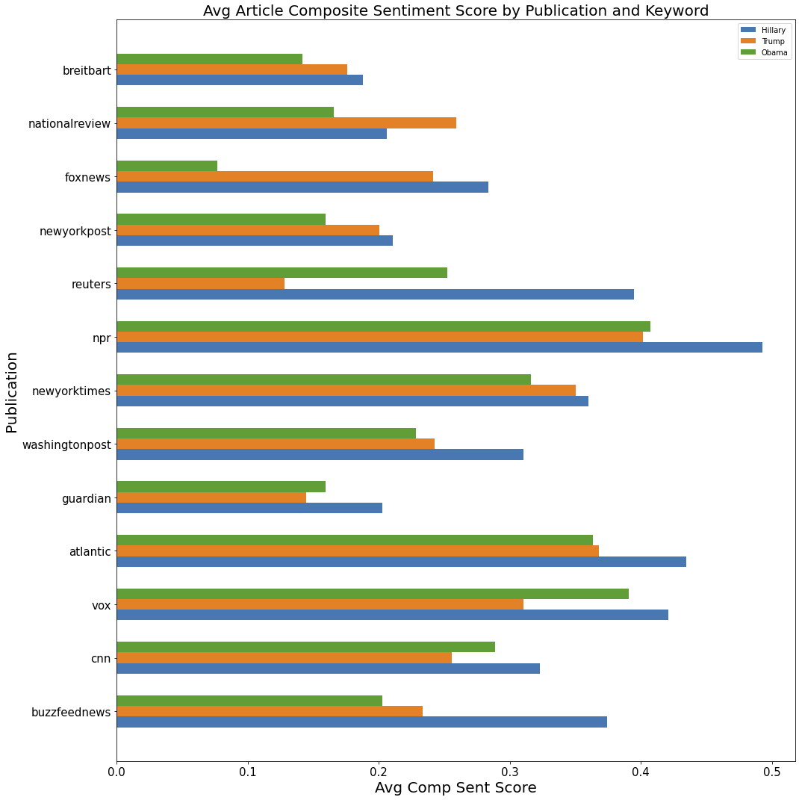
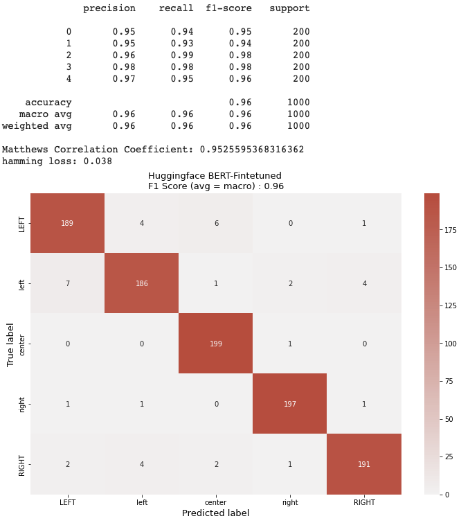

# Publication Prediction
##### Kennedy Bagnol
___

### Premise

For my capstone I wanted to incorporate NLP into my work. I greatly enjoyed NLP on one of my previous projects, and I wanted to expand on my previous work and venture deeper into the the world of Machine Learning and language.

I also wanted to work on something that would be relevant to the world right now, and as news media becomes ever more pervasive in our lives, understanding how they function and what bias they may have becomes more important every day.

___
### Problem Statement

I created two models for this project trying to answer two different questions.

Can I create a model that can determine what publication an article comes from?

Can I create a model that determines the political bias of an article?

___

### Executive Summary

As the internet has developed, news media has increased their reach further than ever before. With this comes the prevalence of just a few outlets dominating the coverage in someone's life. While this can be good as it means the average person is more informed, it can be problematic if the information they are learning is politically skewed.

This problem is what this project attempts to partially address. The idea being, if people understand where their news is coming from and what kind of bias it has, they will digest it more carefully and rely more on critical thinking skills than merely what is written.

Our dataset will consist of over 140,000 articles from several different news publications across the political spectrum. We will be sampling these datasets to create our models as I currently do not have the power to utilize all of the data I have.

___

### Data Dictionary
| Column       | Description                          |
|--------------|--------------------------------------|
| Title        | Headline                             |
| Content      | Article                              |
| Publication  | News publication of the article      |
| Sent_content | The sentiment score of the article   |
| neg_c        | The neg sent score of article        |
| neu_c        | The neu sent score of article        |
| pos_c        | The pos sent score of article        |
| comp_c       | The composite sent score of article  |
| Tokens_c     | Tokenized article                    |
| lem_c        | Lemmatized article                   |
| Sent_title   | The sentiment score of the headline  |
| neg_t        | The neg sent score of headline       |
| neu_t        | The neu sent score of headline       |
| pos_t        | The pos sent score of headline       |
| comp_t       | The composite sent score of headline |
| Tokens_t     | Tokenized headline                   |
| lem_t        | Lemmatized headline                  |

___

### Political Bias of Articles (Taken from allsides.com)

Left : 'buzzfeednews', 'cnn', 'vox'

Lean Left : 'guardian', 'atlantic', 'washingtonpost', 'newyorktimes'

Center : 'npr', 'reuters'

Lean Right : 'newyorkpost'

Right : 'foxnews', 'nationalreview', 'breitbart'

___

### EDA

Sentiment Analysis:

As you can see, there is a general trend amongst left learning publications where headlines that contain 'Hillary' and 'Obama' are more positive than headlines that contain 'Trump'. The inverse is similarly observed amongst right leaning publications. The two major exceptions to this are buzzfeednews and reuters.

Another major trend that you can see is headlines are generally more negative than articles. This is some evidence that our news media is more 'fear based' where they will run negative headlines to grab attention and get clicks whereas the actual article is not as negative in nature.

### Model Methodology

For each model I created a dataset, ran it through a BERT transformer, and fed those results into a standard Neural Network.

Bias Model:

For this model, I split my data into 5 different classes based on the political bias of each outlet (see above). I then filtered this data to pull only political articles from each class. Finally, I sampled 2500 articles from each class to create my dataset for modeling.

Publication Model:

I simply split each publication into it's own dataset, and then sampled 3000 articles from each publication for this model.

Neural Network Model:

The Neural Network I used for this project was a single layer NN with a 8192 nodes and a dropout of .5. I suspect with more fine tuning I would've achieved better results, but I did not have the time nor the power to gridsearch through all of the possible parameters for this NN.

### Results of Models

___

### Conclusions   

Overall, I believe these models were a resounding success.

As my metric for the efficacy of the models, I used the Matthews Correlation Coefficient (MCC) rather than accuracy or F1 score. The MCC is a better measure as it takes into account the balance of the correct values rather than just the correct values. For example, if a cm has: 90TP | 5FP | 1TN | 4FN then it would have an accuracy of 91% but that does not reflect how poorly the model did on the negatives. However, that same model would have a MCC of .14, reflecting that it did very poorly on the negative values.

It is for this reason that the MCC on my models is incredibly impressive, as it means my models did well in all aspects.

Bias Model:

This model achieved a MCC of .95. This is a fantastic score that I believe could be even higher. This means that my model had an fantastic accuracy as well as a very low amount of false negatives and false positives. I believe this model reveals that you can analyze political bias of an article using NLP and Machine Learning.

Publication Model:

This model achieved a MCC of .93 (rounded). This is also a fantastic score that I believe could be even higher. I was not expecting this robust of a result from this model as I believed that these predictions were much harder than the bias predictions as there are 13 classes and these are all very large news publications so I did not believe there would be a large discernable difference between them. However, I am happy to say I was wrong. This is a powerful model that with more data and fine tuning could be even more powerful.

___
### Applications

You may be wondering, what is the point of predicting what publication an article comes from? What I have built is a powerful classification model that can discern small differences between publications well enough in order to distinguish them to a high degree. This means that this model can be used for anything where you might need to look at the 'style' of a certain block of words or be able to distinguish between two articles. I will now go over some practical applications for this model.

Plagiarism:

This model could be used to combat plagiarism in a more robust way than before. In general, plagiarism detectors look for matching text and formatting in order to spot copycats. This model could go a step further and look to see if someone plagiarism someone's 'style' of writing. Since it can pick up differences in news publication styles, that means it can also match styles to one another to see what degree of similarity there is between the two.

Response Organization:

For a large organization, this model could be used to classify customer responses in order to study them more carefully. It could be trained to differentiate between responses about various types of technical issues or really any different responses classes there may be. This would be a 'filter' in a sense that would allow you more control and organization of your customer response data.

Case Search:

For a law firm, this could be used to search through a database of court cases and find similar court cases to the one that is currently being worked on. This would be incredibly powerful as it would allow lawyers to instantly find precedent for their cases and cut down a large amount of search time.

### Future Exploration

In the future I would like to explore the Neural Network and try to understand what exactly it is looking at to classify the data. Extending this, I would want to visualize the difference between publications and political bias classes in order to create even more robust models or extend this project to various applications.

Additionally, I would just like more power so I can make this model as strong as possible. I believe I could get at least another 2-5% increase in performance across both models, but the time and power it would take to achieve this increase would be exponentially larger than what it took to get to this point.

## Sources
---
#### **BERT Transformer**
1.[Multi Class BERT Transformer](https://www.google.com/search?q=bert+transformer+multiclass&client=safari&rls=en&sxsrf=AOaemvLGnUPUyb8RvBiA9SSsQNWHxoDfCA%3A1637272550689&ei=5suWYdOhKcna0PEP0LW6MA&oq=bert+transformer+mult&gs_lcp=Cgdnd3Mtd2l6EAMYADIECCMQJzIGCAAQFhAeOgcIABBHELADOgUIABCABEoECEEYAFD4FljjG2DvIWgCcAB4AIABY4gB8wKSAQE0mAEAoAEByAEIwAEB&sclient=gws-wiz)

2.[BERT Transformer](https://jalammar.github.io/illustrated-bert/)

3.[Multiclass Text Classification](https://github.com/b-analyst/Mental-Health-Label-Prediction/blob/master/Capstone%202/Capstone%202%20Codes/BERT_finetune.ipynb)

#### **Etc.** various sources of information
1.[Machine Learning](https://towardsdatascience.com/machine-learning-text-processing-1d5a2d638958)

2.[Sentiment Analysis](https://towardsdatascience.com/sentimental-analysis-using-vader-a3415fef7664)

3.[Stemming in Nltk](https://machinelearningknowledge.ai/beginners-guide-to-stemming-in-python-nltk/)
